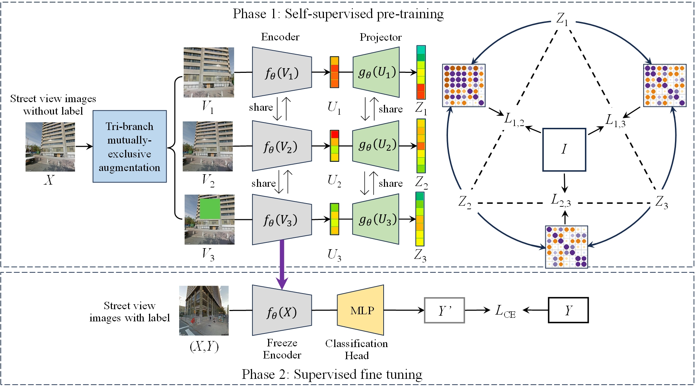

# Street View Imagery Self-Supervised Learning with Trilateral Redundancy Reduction for Urban Functional Zone Identification

*Note: Concise codes are provided. A more detailed *version* needs to be organized.*

## Datasets

* [City-Scale Maps (CSM)](https://syncandshare.lrz.de/dl/fiTFS5He9bZsR4Urh8hZGDGg/BIC_GSV.tar.gz)
* [BEAUTY](https://pan.baidu.com/share/init?surl=S-tEfY5_-Iuh1nrncGdKqQ&pwd=92eh)

## Requirements

CUDA  11.4

Python 3.10

Pytorch  1.11.0

Torchvision 0.12.0
